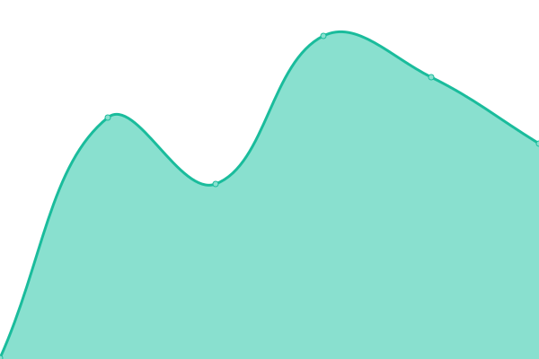

# [📈 Live Status](https://mowfun.github.io/upptime): <!--live status--> **🟧 Partial outage**

This repository contains the open-source uptime monitor and status page for [mowfun](https://mowfun.github.io/upptime), powered by [Upptime](https://github.com/upptime/upptime).

With [Upptime](https://upptime.js.org), you can get your own unlimited and free uptime monitor and status page, powered entirely by a GitHub repository. We use [Issues](https://github.com/mowfun/upptime/issues) as incident reports, [Actions](https://github.com/mowfun/upptime/actions) as uptime monitors, and [Pages](https://mowfun.github.io/upptime) for the status page.

<!--start: status pages-->
<!-- This summary is generated by Upptime (https://github.com/upptime/upptime) -->
<!-- Do not edit this manually, your changes will be overwritten -->
<!-- prettier-ignore -->
| URL | Status | History | Response Time | Uptime |
| --- | ------ | ------- | ------------- | ------ |
|  [MowFun 主網站](https://mowfun.app/) | 🟩 Up | [mow-fun.yml](https://github.com/tzumowfun/mowfun/commits/HEAD/history/mow-fun.yml) | 

 232ms
     
 | 

<a href="https://mowfun.github.io/upptime/history/mow-fun">100.00%</a>
    

|  [Supabase Database](https://wmjleoufkrurqyclafcl.supabase.co/rest/v1/) | 🟥 Down | [supabase-database.yml](https://github.com/tzumowfun/mowfun/commits/HEAD/history/supabase-database.yml) | 

 132ms
     
 | 

<a href="https://mowfun.github.io/upptime/history/supabase-database">0.00%</a>
    

|  [Supabase Auth](https://wmjleoufkrurqyclafcl.supabase.co/auth/v1/health) | 🟥 Down | [supabase-auth.yml](https://github.com/tzumowfun/mowfun/commits/HEAD/history/supabase-auth.yml) | 

 23ms
     
 | 

<a href="https://mowfun.github.io/upptime/history/supabase-auth">0.06%</a>
    

|  [Supabase Storage](https://wmjleoufkrurqyclafcl.supabase.co/storage/v1/) | 🟥 Down | [supabase-storage.yml](https://github.com/tzumowfun/mowfun/commits/HEAD/history/supabase-storage.yml) | 

 714ms
     
 | 

<a href="https://mowfun.github.io/upptime/history/supabase-storage">0.50%</a>
    

<!--end: status pages-->

[**Visit our status website →**](https://mowfun.github.io/upptime)

## 📄 License

- Powered by: [Upptime](https://github.com/upptime/upptime)
- Code: [MIT](./LICENSE) © [Anand Chowdhary](https://anandchowdhary.com), supported by [Pabio](https://pabio.com)
- Data in the `./history` directory: [Open Database License](https://opendatacommons.org/licenses/odbl/1-0/)
